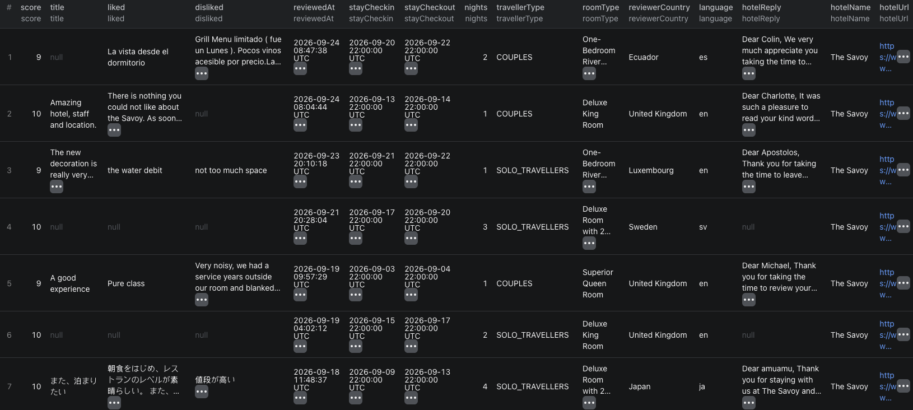

# How to Scrape Booking.com Hotel Reviews in Node.js

This example calls our Booking Reviews Scraper on Apify. It does not implement a Booking.com scraper from scratch.



This screenshot is from a separate run and includes score-only rows. The input below requests written reviews only. The hero illustration is in [`images/booking_reviews_blog.png`](./images/booking_reviews_blog.png).

## What this example does

- Sends one hotel URL and asks for up to ten written reviews
- Filters by the guest's check-in date, not publication date
- Waits for the Actor and fetches its dataset
- Prints each review with its stay and publication dates

`maxReviewsPerHotel` applies separately to each hotel. `stayedFrom` filters on check-in; `reviewedSince` filters on publication date. Booking.com exposes roughly the last 36 months of reviews.

## Prerequisites

- Node.js 18 or later
- An Apify account and [API token](https://console.apify.com/settings/integrations)

## Installation

```bash
npm install
```

## Environment setup

Copy `.env.example` to `.env`, then replace the placeholder with your Apify token. Do not commit `.env`.

## Usage

```bash
npm start
```

## Code example

```js
import { ApifyClient } from 'apify-client';
import 'dotenv/config';

// Initialize the ApifyClient with your Apify API token
// Set APIFY_TOKEN in your .env file (copy .env.example to get started)
const client = new ApifyClient({
    token: process.env.APIFY_TOKEN,
});

// Prepare Actor input
const input = {
    "startUrls": [
        {
            "url": "https://www.booking.com/hotel/gb/the-savoy.html"
        }
    ],
    "maxReviewsPerHotel": 10,
    "sortBy": "newest",
    "stayedFrom": "2026-01-01",
    "onlyWithText": true
};

// Run the Actor and wait for it to finish
const run = await client.actor('piotrv1001/booking-reviews-scraper').call(input);

// Fetch and print Actor results from the run's dataset (if any)
console.log('Results from dataset');
console.log(`💾 Check your data here: https://console.apify.com/storage/datasets/${run.defaultDatasetId}`);
const { items } = await client.dataset(run.defaultDatasetId).listItems();
items.forEach((item) => {
    console.dir(item);
});

// 📚 Want to learn more 📖? Go to → https://docs.apify.com/api/client/js/docs
```

## Example output

[`sample-output.json`](./sample-output.json) contains two abbreviated rows. The first row is abbreviated from our Actor documentation. The second is an illustrative mock showing the same schema; it is not a real guest review. Useful fields include `hotelName`, `score`, `reviewedAt`, `stayCheckin`, `stayCheckout`, `liked`, `disliked`, `roomType`, and `travellerType`.

## Use cases

- Study guest feedback about a particular stay period
- Separate late-posted reviews from the month of the stay
- Compare comments by room or traveller type
- Monitor newly published feedback with `reviewedSince`

## Try the Actor on Apify

**[Open the Booking.com Hotel Reviews Scraper on Apify](https://apify.com/piotrv1001/booking-reviews-scraper)**

## Related resources

- [Read the step-by-step guide](https://www.falconscrape.com/blog/how-to-analyze-booking-com-hotel-reviews-by-stay-date)

## License

MIT
